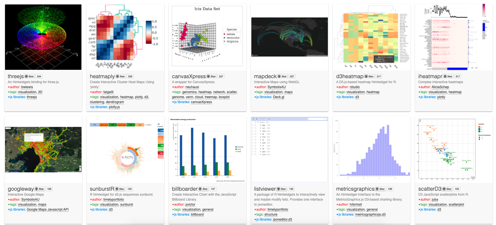

```{r setup, include=FALSE}
knitr::opts_chunk$set(
	echo = TRUE,
	message = FALSE,
	warning = FALSE
)
library(plotly) ##Must use devtools::install_github("ropensci/plotly")
library(shiny)
library(DT)
library(ggforce)
library(htmlwidgets)
library(sf)
library(leaflet)
```

> "[shiny is cool blah blah blah...but] in the long run when you want to build serious and more visual 
>  appealing apps, you most likely need to utilize javascript to make most of the web framework."
>
> `r tufte::quote_footer('-- bigdatahabits.com "Why you should learn JavaScript to master R Shiny"')`


### The challenge

Shiny gets crapped on a lot because it can be really slow and clunky. One reason for this is the frequent server-side re-rendering, so complex plots or maps, or just apps with a lot moving parts move really slowly. Javascript, on the other hand, runs in the browser and can operate on existing DOM elements, which allows for fast interactive visualizations and a better user experience.

So instead of throwing out the data viz baby with the bathwateR, why not use JavaScript with R to get the best of both worlds?

### Background
#### Existing JavaScript and R integration
Though it's mostly invisible, a `shiny` app is essentially just a JavaScript app that can talk with an R session. Even if your shiny app is completely written in R, it's a web application with HTML, CSS, and
JavaScript elements, it's just mostly using simplified, pre-packaged functionality. This is what makes
shiny so easy to use, but also so clunky and awkward (sometimes).

In addition to the highly simplified built-in, hidden, JavaScript functionality, and before jumping into full customization with HTML, CSS, and JavaScript, it's worth noting that there are a
number of packages that extend `shiny` with bundled JavaScript functionalities. Two prime examples are 
`shinyjs` and `htmlwidgets` [(widget gallery)](http://gallery.htmlwidgets.org/)



##### JavaScript in TFT shiny apps
We have used some of these JavaScript extender packages in TFT shiny apps before, particularly for hiding/showing elements for a workflow.

For example, the Solano SPS shiny app has a program design workflow that relies
on hiding and showing elements according to "back" or "next" button clicks.

[(Solano SPS)](https://thefreshwatertrust.shinyapps.io/SolanoSPS/)

```{r eval=FALSE}
  # function for hiding/showing elements
  hideStuff <- function(output_names){
    lapply(output_names, function(output_name){
      shinyjs::hideElement(output_name)
    })
  }
  
  showStuff <- function(output_names){
    lapply(output_names, function(output_name){
      shinyjs::showElement(output_name)
    })
  }
    
  peek_a_boo <- function(inputName){
    string <- sub('.*\\$', '', inputName) # extract part after "input$" as string
    currentPanel <- as.integer(sub('.*\\_', '', string)) # pane number
    dir <- substr(string, 0, 4) # 'back' or 'next'
    # some details omitted
    nextPanel <- paste0("panel", nextPanelNum)
    eval(parse(text=paste0("showStuff(", nextPanel, ")")))
    eval(parse(text=paste0("hideStuff(allPanels[!allPanels %in% ", nextPanel, "])")))
  }
```


And we've written our own JavaScript functions to make Shiny do what we want.

One example: button support in shiny is garbage: every button needs a unique observer
to listen for clicks, so if you want to add a button ("Add item to cart" for example) for every item in list, you'd need to create as many observers as items in the list. That gets tricky when the list is changing based on user input. 

[(blog)](http://www.open-meta.org/technology/one-observer-for-all-buttons-in-shiny-using-javascriptjquery/)

In TFT's case, Maddee and I wanted to be able to add a "Zoom to field on map" button for every row in a table, so we wrote a function in our server code (in R) to iteratively generate a button object with a unique ID for every row, plus a simple jQuery function to watch for button clicks and communicate the button id back to shiny.

Here's the function for creating a each action button:
```{r message=FALSE, warning=FALSE, eval=FALSE}
buttonInput <- function(FUN, len, id, ...) {
    inputs <- character(len)
    for (i in seq_len(len)) {
      inputs[i] <- as.character(FUN(paste0(id, i), ...))
    }
    inputs
}
```

Then adding the buttons dynamically when the data table is rendered
```{r message=FALSE, warning=FALSE, eval=FALSE}

dt <- data.table(df_for_table_reactive()) %>%
  rename("TN, TP, and Sediment uplift efficiency (benefit/$)" = N_P_sed)
    
# append a column with buttons generated with buttonInput function
dt <- cbind(dt, 
            Locate = buttonInput(
            FUN = actionButton,
            len = nrow(df_for_table_reactive()),
            id = 'button_',
            label = "Go To Field",
            onclick = 'Shiny.onClick(\"lastClick\",  this.id)',
            style="color: #fff; background-color: #337ab7; border-color: #2e6da4",
            class = 'btn-primary'
          )
)
```

Here's the jQuery function that listens to for the click:
```{r message=FALSE, warning=FALSE, eval=FALSE}
$(document).on('click', 'button', function(e) {
   e.stopPropagation();
   if(typeof BUTTON_CLICK_COUNT == "undefined") {
      BUTTON_CLICK_COUNT = 1;
    } else {
      BUTTON_CLICK_COUNT ++;
    }
    Shiny.onInputChange("js.button_clicked",
      e.target.id + "_" + BUTTON_CLICK_COUNT);
});
```

(Note: this is not a perfect implementation. Improvement info [(here)](http://www.open-meta.org/technology/adding-anchors-to-our-shiny-button-observer/)).

And the shiny observer that receives the info from jQuery and zooms the map in response:
```{r message=FALSE, warning=FALSE, eval=FALSE}
observeEvent(input$js.button_clicked, {
    uid = str_split(input$js.button_clicked, "_")
    button = uid[[1]][1]
    n = uid[[1]][2]
    
    # take some action upon click
    map <- leafletProxy("map")
        map %>% clearPopups()
        dist <- 0.004
        lat <- df_for_table_reactive()[n,]$Lat
        lng <- df_for_table_reactive()[n,]$Long
        field_id <- df_for_table_reactive()[n,]$`Field ID`
        field_to_highlight <- fields_rank_subset() %>% filter(fieldId == field_id)
        print(paste("field to highlight: ", field_to_highlight))
        
        map %>% fitBounds(lng - dist, lat - dist, lng + dist, lat + dist) %>%
          clearGroup('highlight') %>%
          addPolygons(data = field_to_highlight
        # shortened for brevity
}
```

[(Grand View Explorer shiny app)](https://thefreshwatertrust.shinyapps.io/grand_view_explorer/)

### Load some data
This data was generated with the program design tab in the Solano shiny app. The program is a $4 million dollar attempt to maximize benefits to GDEs.
```{r}
results <- readRDS(file = "data/results_jitter_df.rds")
fieldIds <- readRDS(file = "data/results_chosenIds.rds")
df_onlyTheBest <- readRDS(file = "data/df_onlyTheBest.rds")
```

### The goal
The dataset includes BasinScout results for 900 simulations. Each simulation is an optimized "program" from within a randomly selected
pool of ag fields. Each program has a total/sum value for the following variables:

* cost
* nitrogen runoff
* phosphorus runoff
* sediment runoff
* infiltration volume for storage
* infiltration volume for GDE support
* irrigation volume from groundwater
* irrigation volume from surface water

I want to be able to explore all of this data intuitively without requiring 50 plots and 50 maps. Ideally, this would include three components:
a plot (or set of plots), a data table, and a map. Also, it would be ideal if they could communicate to each other during click/hover events.


### Map plus scatter plot - `sf` and base R

```{r, figures-side, fig.show="hold", out.width="50%"}
p <- results[results$variable == 'Change in infiltration for GDE support',]
plot(p$recruitment, p$value,
     xlab = 'Recruitment success rate',
     ylab = 'Infiltation volume, ft per year',
     main = 'Change in infiltration for GDEs by recruitment rate')

ids <- fieldIds[[55]] # choose a random simulation
m <- df_onlyTheBest[df_onlyTheBest$fieldId %in% ids,]
m <- st_sf(m)
plot(m['netPresentCost'], main = 'Fields in a random program simulation')
#plot(d$value, d$recruitment)
```


### Faceted plots with `ggplot`
`ggplot2` allows you to make really nice plots quickly with only a few lines of code. This is great for a static deliverable, but how do you squeeze this into a dashboard? How do you allow for deeper digging?

```{r, fig.width=11, fig.height=8}
p2 <- ggplot(results, aes(x = recruitment, y = value, color = recruitment)) +
  geom_point(size = 3, alpha = 0.2) +
  geom_smooth(color = 'grey15', alpha = .2, method = 'lm') +
  scale_color_gradient(low = 'grey85', high = 'darkgreen') +
  facet_wrap(~ variable, nrow = 3, scales = "free") +
  theme_minimal() +
  theme(legend.position="bottom") +
  ggtitle("Impacts of $4 million program for GDEs at varying recruitment success rates")
p2
```

## Get interactive with JavaScript
### Convert ggplot to `plotly` object
R is full of wrappers for JavaScript APIs, including plotly, which is probably the easiest of them all.
```{r, fig.width=8, fig.height=3}
library(plotly)
d <- results[results$variable == "Change in infiltration for GDE support",]
plot_ly(d, x = d$recruitment, y = d$value, text = paste("GDE support: ", d$value, " ft/year"),
        mode = "markers", color = d$value, size = d$recruitment)
```

### Create interactive map with `mapbox` or `leaflet`
Mapbox and Leaflet are JavaScript libraries for creating dynamic mapsthat support panning
and zooming.

```{r, fig.width=6, fig.height=4}
library(leaflet)
pal <- colorQuantile("YlOrRd", NULL, n = 8)

m <- st_transform(m, "+init=epsg:4326")
leaflet(m) %>%
  addTiles("CartoDB.Positron") #%>%
  #add_polygons(color = 'green')

```


It's great that this allows tooltips and interactivity and such, but it still only shows one program simulation at a time. More on that in a bit.

## Use `DT` (R interface to DataTables plug-in for jQuery JavaScript library) to build a nice table
There are a lot of impact variables that come out of BasinScout, so it can be challenging to include them all in a UI without the result being
overwhelming. One option I want to explore is the use of a nice data table to convey the results.

My goal here is to have columns for the variable name, units, a sparkline or small plot showing the trend, the min, the mean, and the max. 
#```{r}
# must enter your mapbox tokey with Sys.setenv('MAPBOX_TOKEN' = 'paste your token here')
#plot_mapbox(m)
#```


## Link the plot and the map
In order to make the not-so-intuitive connection between the points on the plots and the polygons on the map, I want to make it possible
to click (or double-click) on the points in the plots and have the map show the fields that were selected in that optimal program simulation.

#```{r, fig.width=6, fig.height=4}
# must enter your mapbox tokey with Sys.setenv('MAPBOX_TOKEN' = 'paste your token here')
#plot_mapbox(m)
#```


## Add simple radio buttons that will highlight sets of point in the plots
The goal here is to allow the user to visualize outcomes for different buckets of recruitment success rates (low, medium, high, perfect), which in my
opinion makes it easier to parse the chaos of the scatter plots.

#```{r echo = FALSE}
#selectInput("n_breaks", label = "Number of bins:",
#              choices = c(10, 20, 35, 50), selected = 20)
#
#sliderInput("bw_adjust", label = "Bandwidth adjustment:",
#              min = 0.2, max = 2, value = 1, step = 0.2)
#```


- Demonstrate linking map and table
- Demonstrate linking plot and map
- Demonstrate linking plot and table (combine with above?)
- Add slider for recruitment rates (or buttons for "Low", "Medium", "High", "Perfect")
- Finalize plot + table + map
  - Inspo: https://www.economist.com/news/2020/07/15/the-big-mac-index
  - Inspo: https://twitter.com/DataVizSociety/status/1336110250836058112?s=09
  - Important info:
    - Impact range at different recruitment success rates (plots + summary values/ranges?)
    - Map of best program, and map of frequency of inclusion for other ranges.
      - When click on a recruitment range button - update field with summary count
      - Table and map synced - table shows all fields selected in that range with count (color coded)
      - Plots highlight the simulations from those ranges
      - map symbology/colors change when a subplot is clicked on (click on N, map symbolized by N)
      - Add dynamic text for trendlines ("for every 5% increase in recrutiment success, TN uplift increaeses by x lbs/yr")


